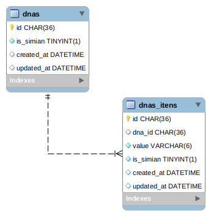

  

# Simios API

  

Only another project for academic purposes with AdonisJS and [Domain Driven Design](https://en.wikipedia.org/wiki/Domain-driven_design)

  
  Trello:
- [Trello URL](https://trello.com/b/WBKul8qe/simios)

 Project in Heroku:
- [Heroku URL](https://damp-falls-68282.herokuapp.com/)

Required:
-  [ Adonis.JS](https://adonisjs.com/docs/4.1/installation)

-  [Node.JS](https://nodejs.org/en/download/)

  

Optional:

  

-  [Docker](https://docs.docker.com/get-docker/)

The file **Simians.postman_collection.json** is Postman collection with base url in Heroku

## Install Adonis.JS

  
Run

```bash

npm i -g @adonisjs/cli

```


## Setup without docker

  

Install project

```bash

npm install

```

If you have problem with PERMISSIONS

  

```bash

npm install --unsafe-perm

```

## Run without docker

  

```bash

adonis serve

```

## Setup & Run with docker

  

Run docker-compose in background (-d)

```bash

docker-compose up -d

```

  

## Migrations && Seeds

  

Run the following command to run startup migrations.

  

```bash

npm run db

```

  

## ER Model

